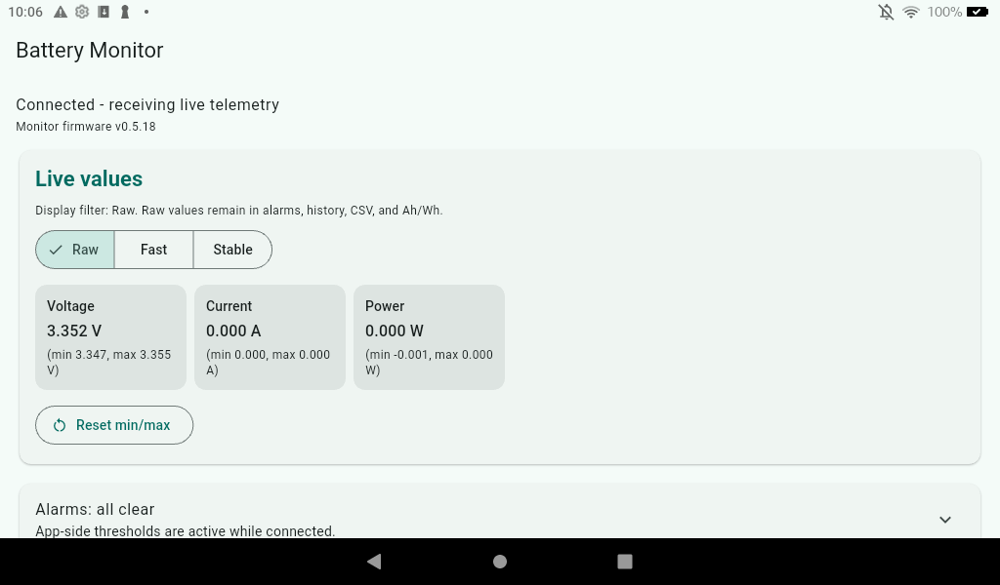
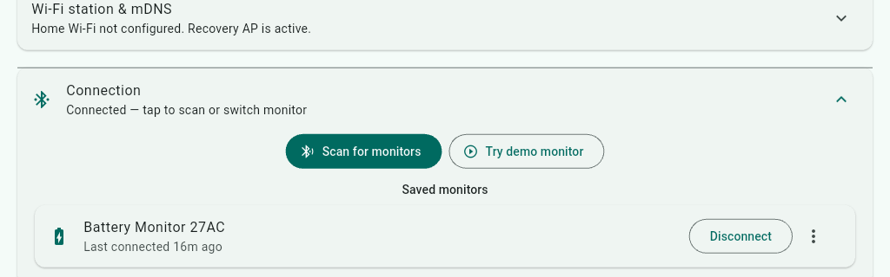

# Battery Monitor App

Public cross-platform Flutter companion app for the Battery Monitor firmware.
It connects directly to the monitor over Bluetooth Low Energy; it has no
account or cloud service. Internet is only used when the user explicitly checks
GitHub Releases or downloads a firmware-release asset before a BLE update.

## Linked firmware and shared contract

This app pairs with the public [Battery Current Monitor firmware
repository](https://github.com/duceppemo/battery_current_monitor). The
repositories stay separate but release together whenever the BLE protocol or
OTA behavior changes. [docs/BLE_PROTOCOL.md](docs/BLE_PROTOCOL.md) is the
canonical app-side compatibility contract; it mirrors the firmware copy.
Binary Telemetry v1 is a fixed 20-byte, one-Hz notification that works without
MTU negotiation. The app reads monitor firmware version only after BLE
connection, then compares it with the public firmware release before offering
download and install.

## Current version

`0.3.18+27` — a focused, foreground BLE companion for one monitor at a time:
live telemetry and dashboard data, acknowledged controls, session logging
with CSV export and capacity test reports, signed BLE OTA, home Wi-Fi setup,
a battery fuel gauge, load-protection relay control, a remembered list of
saved monitors with a device-side name shared with the Web Dashboard, and
opt-in session-energy persistence. See
[docs/FEATURES.md](docs/FEATURES.md) for the full feature list and how each
one works.

| Live dashboard | Saved monitors |
| --- | --- |
|  |  |

## Documentation

- [docs/FEATURES.md](docs/FEATURES.md) — full feature list, display filter
  modes, session timeline, capacity progress/test reports, load protection,
  firmware updates
- [docs/BLE_PROTOCOL.md](docs/BLE_PROTOCOL.md) — the firmware/app BLE
  contract: telemetry, dashboard pages, control commands
- [docs/PLATFORM_SETUP.md](docs/PLATFORM_SETUP.md) — platform permissions
  and signing guidance
- [docs/DEVELOPMENT.md](docs/DEVELOPMENT.md) — local setup and project layout
- [docs/ROADMAP.md](docs/ROADMAP.md) — implementation order and what's
  planned next

## License

MIT. See [LICENSE](LICENSE).
